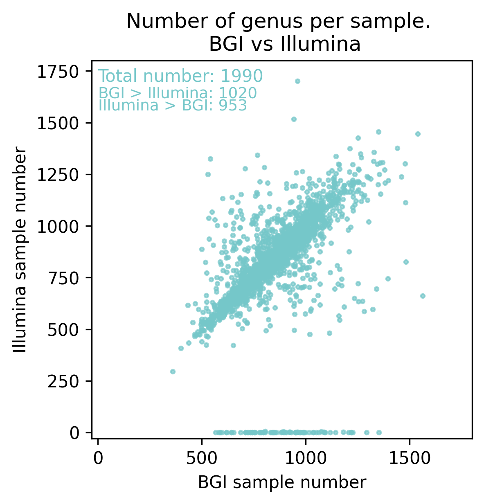
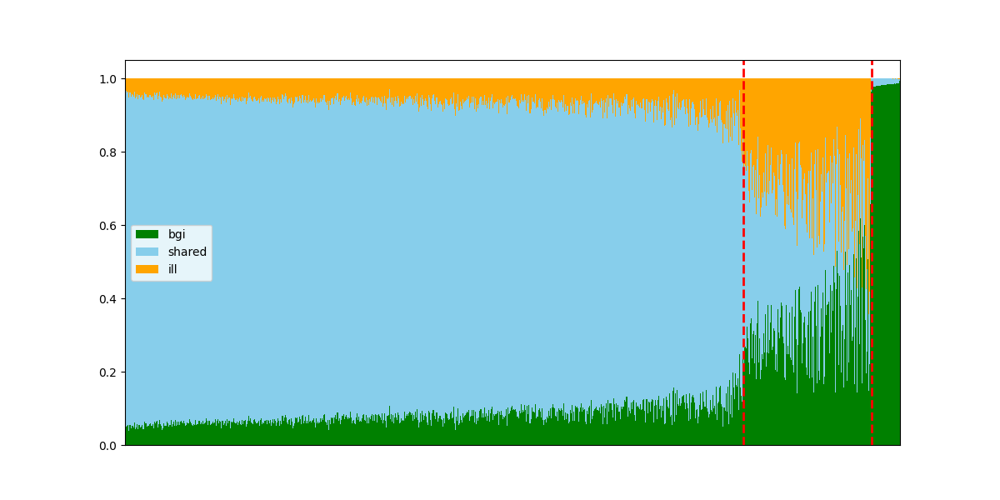
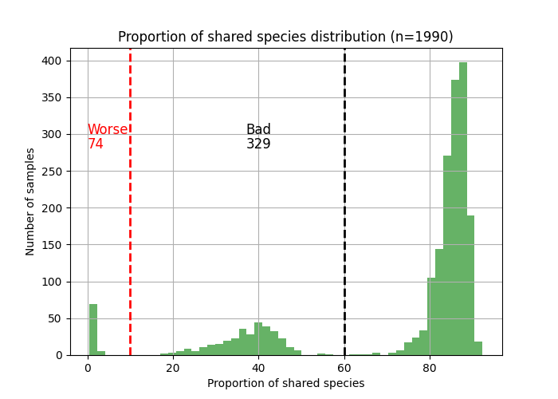

### PROJECT: 2023_Illumina_vs_BGI

## Step1. FastQC Results Comparison
check folder "step1_Reads_quality_comparison_FASTQ"

>
>!! We used GTDB release 214 database as a custom database for Kraken.
>
### Prerequisites

To run the script and reproduce the results, you need to have the following software and data installed:

- Kraken (version 2.1.1): Link https://github.com/DerrickWood/kraken
- Braken (version 2.8): Link https://github.com/jenniferlu717/Bracken
- Prebuild GTDB custom Kraken database
- seqtk Link https://github.com/lh3/seqtk
- Illumina sequencing data
- BGI sequencing data

### Kraken aggregation result files description
aggregation/Cross-Platform_set/abud/Family_BGI_merged_output_all.xlsx

- Folders "Cross-Platform_set" / "Intra-Platform_set" reflect sequencing sample pair at the same/different platform
- Folders "abud" / "number" means Kraken modes to produce relative abudance or reads number
- "Family" - level of aggregation
- "BGI" - sequencing platform
- "all" - result without any filtering / "part" - filter out all species with prevalence < 1%>

### RAD_aggregation_p2.ipynb
Compare the number of detected Genus/Family between BGI-Illumina sample pair

### RAD_aggregation_p3.ipynb
Compare witch exact Genus Genus/Family between BGI-Illumina sample pair

## !!! Re-run KRAKEN for "bad" & "ugly" sample groups